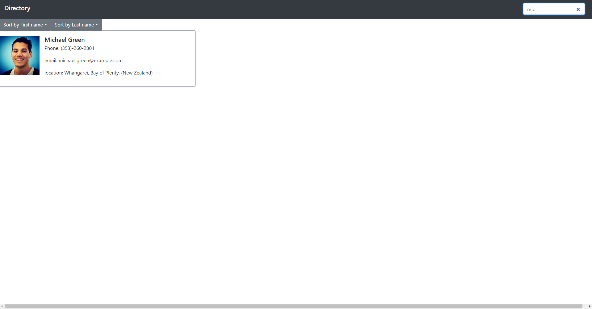

# React-Employee-Directory

React-Employee-Directory is an app that allows users to be able to view an entire employee directory at once and have have quick access to their non-sensitive information. Users are able to sort employees by name, or filter out based on a live search.

## Table of Contents
* [Installation](#Installation)
* [Usage](#Usage)
* [Demo](#Demo)
* [Submissions](#Submissions)

## Installation
* Pull this repo to your local drive then using terminal/shell cd into the root directory of the repo.

* Then run npm i to install all dependancies listed in the package.json folder.

* This project was bootstrapped with [Create React App](https://github.com/facebook/create-react-app). So this will take a while!

* To start the app run `npm start`

## Usage 

 An Employee directory that is rendered based on sort and search paramiters.

## Demo

## Submissions

GitHub repository: https://github.com/malex19889/React-Employee-Directory.git

Deployed app: https://mw-react-employee-tracker.herokuapp.com/

